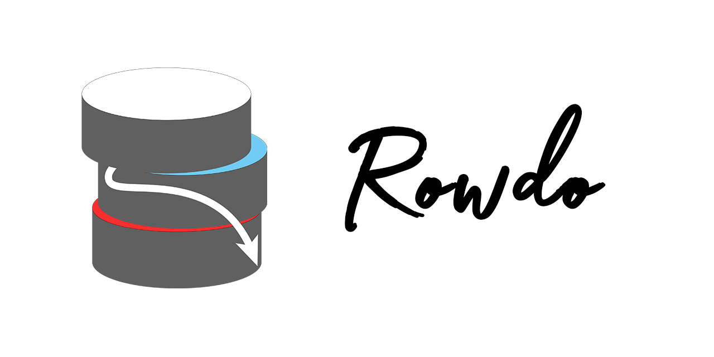

# Getting Started

<div style="text-align: center">

</div>

### How Rowdo Works
Rowdo polls it's [files table](./Reference/Tables/#files-table) to track URLs and download them to file system. Results regarding the download operation are also depicted this table.

In case of a download error, details are inserted in to the [error logs table.](./Reference/Tables/#error-logs-table)

### Download Rowdo
For windows operating systems a pre-packed single file executable is [released](https://github.com/shotwn/Rowdo/releases/latest) in github.

To run rowdo directly as a python script, clone the repository and simply call `main.py` after installing all the required dependencies in `requirements.txt`.

It is highly recommended to use a `venv` environment.
``` powershell
python -m venv env
.\env\Scripts\activate
```

Install all dependencies
``` powershell
pip install -r requirements.txt
```

Run rowdo
``` powershell
python main.py
```

### Configuration
Rowdo uses a global configuration file next to it's main script or executable called [config.ini](Reference/Config.md). Minimum required configuration to connect MySQL databases can be found [here](./Reference/Config/#bare-minimums).

In Windows environments, Rowdo executable can be installed as a [service](./Reference/Windows%20Specific/#install).

### Creating a Download Task
To download a file basically `INSERT` a new row in [files table](./Reference/Tables/#files-table).

``` sql
INSERT INTO `rowdo_files` (`url`)
VALUES ('https://raw.githubusercontent.com/shotwn/Rowdo/main/assets/Logo.png')
```

!!! info
    Operation result will get set to [status field](./Reference/Tables/#status).


You can set a file name or folder/name
``` sql
INSERT INTO `rowdo_files` (
    `url`,
    `filename`
)
VALUES (
    'https://raw.githubusercontent.com/shotwn/Rowdo/main/assets/Logo.png',
    'logos\\rowdo.png'
)
```

It is also possible to run image resizing on file-by-file basis.
``` sql
INSERT INTO `rowdo_files` (
    `url`,
    `resize_mode`,
    `resize_ratio`
)
VALUES (
    'https://raw.githubusercontent.com/shotwn/Rowdo/main/assets/Logo.png',
    '2',
    '2.5'
)
```

Using [passthrough](./Reference/Tables/#passthrough) resize mode you can format images using PIL library without resizing them.
``` sql
INSERT INTO `rowdo_files` (
    `url`,
    `resize_mode`,
    `filename`
)
VALUES (
    'https://raw.githubusercontent.com/shotwn/Rowdo/main/assets/Logo.png',
    '0',
    'logo.jpg'
)
```

### Deleting a Downloaded File
Rowdo can delete files using delete command.

After setting a new command value it is important to reset [status field](./Reference/Tables/#status). Unless status field is set to the [initial state](./Reference/Tables/#waiting-to-process), the new command won't be processed.

Deleting a downloaded file while keeping the row. Notice how status is reset to `0`.
``` sql
UPDATE `rowdo_files`
    SET `command` = '3', `status` = '0'
    WHERE `rowdo_files`.`id` = 1
```